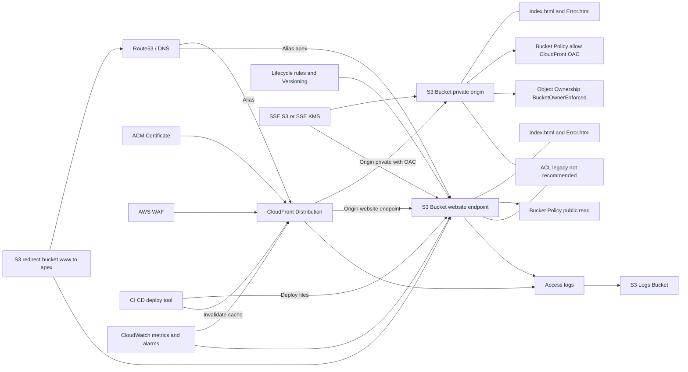

# Hébergement d’un site Web statique à l’aide d’Amazon S3

Objectifs: 
* Découverte de AWS S3 et 1 cas d'usage simple
* Découverte des règles et configurations liées aux ressources cloud (Policies, ACL, ...)
* Découverte des différents composants connexes (Cloud Front, Route 53) et des autres types de services et alternatives (ex: Amplify...)

Il existe plusieurs façons d'héberger un site statique sur AWS:
- S3
- Amplify

## Scénario 1: Mise en place simple avec S3

https://docs.aws.amazon.com/fr_fr/AmazonS3/latest/userguide/WebsiteHosting.html

```mermaid
architecture-beta
    group aws_cloud(aws:aws-cloud)[AWS Cloud]
        service s3_bucket(aws:arch-amazon-simple-storage-service)[S3 Website Bucket] in aws_cloud
        service bucket_policy(aws:arch-bucket-policy)[Bucket Policy] in aws_cloud
        service bucket_acl(aws:arch-bucket-acl)[Bucket ACL] in aws_cloud
        service cloudfront(aws:arch-amazon-cloudfront)[CloudFront CDN] in aws_cloud
        service route53(aws:arch-amazon-route-53)[Route 53 DNS] in aws_cloud
        service cert_manager(aws:arch-aws-certificate-manager)[Certificate Manager] in aws_cloud

    service user(aws:res-user)[User]

    bucket_policy:L --> R:s3_bucket
    bucket_acl:L --> R:s3_bucket

    user:R --> L:route53
    route53:B --> T:cloudfront
    cloudfront:R --> L:s3_bucket
    cert_manager:T -- B:cloudfront
```

Autre aperçu de l'archi

## Aller plus loin

Herberger une app plus complexe (SSR, SPA, SSG...)
Connecter notre app à un dépot git
...

Ex: https://aws.amazon.com/fr/amplify/

Image:
https://d1.awsstatic.com/onedam/marketing-channels/website/aws/en_US/product-categories/frontend-web-mobile/approved/images/7361d2c9-01e3-4e25-86ca-cb4591c069c2.bee7ede0dd142cad72cdf5f9c5494dc139f2ea4a.png
