# Hébergement d’un site Web statique à l’aide d’Amazon S3

Objectifs: 
* Découverte de AWS S3 et 1 cas d'usage simple
* Découverte des règles et configurations liées aux ressources cloud (Policies, ACL, ...)
* Découverte des différents composants connexes (Cloud Front, Route 53) et des autres types de services et alternatives (ex: Amplify...)


Il existe plusieurs façons d'héberger un site statique sur AWS:
- S3
- Amplify

## Scénario 1: Mise en place simple avec S3

https://docs.aws.amazon.com/fr_fr/AmazonS3/latest/userguide/WebsiteHosting.html

```mermaid
architecture-beta
    group aws_cloud(aws:aws-cloud)[AWS Cloud]
        service s3_bucket(aws:arch-amazon-simple-storage-service)[S3 Website Bucket] in aws_cloud
        service bucket_policy(aws:arch-bucket-policy)[Bucket Policy] in aws_cloud
        service bucket_acl(aws:arch-bucket-acl)[Bucket ACL] in aws_cloud
        service cloudfront(aws:arch-amazon-cloudfront)[CloudFront CDN] in aws_cloud
        service route53(aws:arch-amazon-route-53)[Route 53 DNS] in aws_cloud
        service cert_manager(aws:arch-aws-certificate-manager)[Certificate Manager] in aws_cloud

    service user(aws:res-user)[User]

    bucket_policy:L --> R:s3_bucket
    bucket_acl:L --> R:s3_bucket

    user:R --> L:route53
    route53:B --> T:cloudfront
    cloudfront:R --> L:s3_bucket
    cert_manager:T -- B:cloudfront
```



Autre aperçu de l'archi

```mermaid
flowchart LR
  %% Domain & DNS
  DNS[Route53 / DNS] -->|CNAME / Alias| CloudFront[CloudFront Distribution]
  DNS -->|Alias pour apex| S3_Bucket_Web[Bucket S3 (website endpoint)]
  
  %% TLS
  ACM[ACM Certificate] --> CloudFront

  %% CDN & Origin
  CloudFront -->|Origin (S3 normal) with OAC/OAI| S3_Bucket_Private[Bucket S3 (private, origin)]
  CloudFront -->|Optional origin (S3 website endpoint - no OAC)| S3_Bucket_Web

  %% S3 bucket components
  S3_Bucket_Web --- Index[Index.html / Error.html]
  S3_Bucket_Private --- Index2[Index.html / Error.html]

  %% Access & Policies
  S3_Bucket_Web -->|Block Public Access OFF + Bucket Policy| BucketPolicyPublic[Bucket Policy: s3:GetObject public]
  S3_Bucket_Private -->|Bucket Policy grants CloudFront OAC / OAI| BucketPolicyCF[Bucket Policy: allow CloudFront principal]
  S3_Bucket_Private -->|Object Ownership: Bucket owner enforced| ObjectOwnership[Object Ownership = BucketOwnerEnforced]

  %% ACL note
  ACL_note[(ACLs)\n(Options legacy - not recommended)]
  S3_Bucket_Web --- ACL_note
  S3_Bucket_Private --- ACL_note

  %% Security & ops
  WAF[WAF] --> CloudFront
  LogsS3[Access logs (S3 / CloudFront)] --> S3_Logs[(Bucket de logs)]
  S3_Bucket_Web --> LogsS3
  CloudFront --> LogsS3

  CI[CI/CD (GitHub Actions, CodePipeline)] -->|Deploy| S3_Bucket_Web
  CI -->|Invalidate| CloudFront

  Monitoring[CloudWatch / Alarmes] --> CloudFront
  Monitoring --> S3_Bucket_Web

  Lifecycle[Lifecycle rules / Versioning / MFA delete] --> S3_Bucket_Web
  Encryption[SSE-S3 or SSE-KMS] --> S3_Bucket_Private
  Encryption --> S3_Bucket_Web

  %% Extras
  RedirectBucket[Redirect bucket (www -> apex)] --> DNS
  RedirectBucket --> S3_Bucket_Web

  style S3_Bucket_Private stroke:#0366d6,stroke-width:2px
  style CloudFront stroke:#ff9900,stroke-width:2px
  style DNS stroke:#48a14d,stroke-width:2px
```

## Aller plus loin

Herberger une app plus complexe (SSR, SPA, SSG...)
Connecter notre app à un dépot git
...

Ex: https://aws.amazon.com/fr/amplify/

Image:
https://d1.awsstatic.com/onedam/marketing-channels/website/aws/en_US/product-categories/frontend-web-mobile/approved/images/7361d2c9-01e3-4e25-86ca-cb4591c069c2.bee7ede0dd142cad72cdf5f9c5494dc139f2ea4a.png
